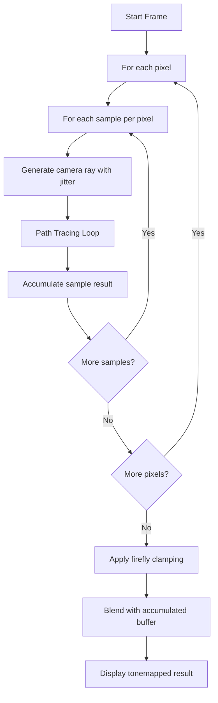
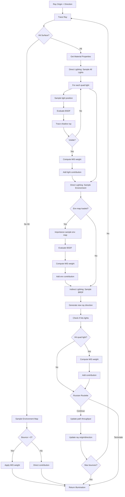

# ChameleonRT Rendering Pipeline

This document provides detailed visual diagrams of ChameleonRT's path tracing pipeline, including the overall rendering loop, path tracing with Multiple Importance Sampling (MIS), and progressive sample accumulation.

## Table of Contents
- [High-Level Overview](#high-level-overview)
- [Detailed Path Tracing Loop](#detailed-path-tracing-loop)
- [Sample Accumulation Strategy](#sample-accumulation-strategy)
- [Rendering Quality Timeline](#rendering-quality-timeline)

---

## High-Level Overview

This diagram shows the top-level rendering loop executed each frame:

**Key Points:**
- Multiple samples per pixel (SPP) for anti-aliasing
- Each sample gets a jittered camera ray for MSAA
- Results are progressively accumulated across frames
- Firefly clamping prevents extreme outliers on glossy surfaces

---

## Detailed Path Tracing Loop

This is the core path tracing algorithm with Multiple Importance Sampling (MIS):

**Algorithm Breakdown:**

### 1. Ray Intersection
- Cast ray into scene using hardware ray tracing (DXR/Vulkan RT)
- If miss: sample environment map (with MIS if not primary ray)
- If hit: proceed to lighting calculations

### 2. Direct Lighting (Multiple Importance Sampling)

**Strategy 1: Light Sampling**
- For each quad light in scene:
  - Randomly sample a point on the light surface
  - Evaluate BRDF at the surface for light direction
  - Trace shadow ray to check visibility
  - If visible: compute MIS weight and add contribution

**Strategy 2: Environment Map Sampling**
- If environment map is loaded:
  - Use importance sampling (CDF-based) to pick direction
  - Evaluate BRDF for that direction
  - Compute MIS weight
  - Add weighted contribution

### 3. Indirect Lighting (BRDF Sampling)

**BRDF-based bounce:**
- Sample Disney BRDF to generate new ray direction
- Check if sampled direction hits any emissive surfaces
- If hit light: compute MIS weight and add contribution
- Use Russian roulette to probabilistically terminate path

### 4. Path Continuation
- Update path throughput by BRDF value and cosine term
- Russian roulette termination (probability based on throughput)
- Continue up to maximum bounce limit (typically 4-8 bounces)

**MIS (Multiple Importance Sampling) Benefits:**
- Combines light sampling and BRDF sampling strategies
- Uses power heuristic to weight contributions
- Reduces variance (less noise) compared to single-strategy sampling
- Especially effective for glossy surfaces and bright light sources

---
