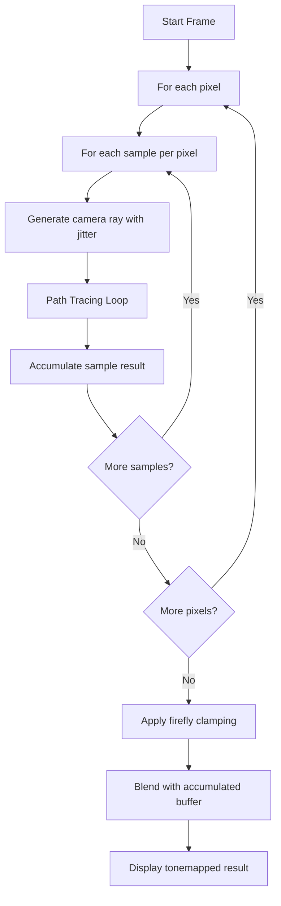
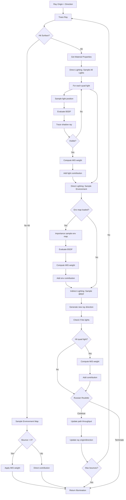
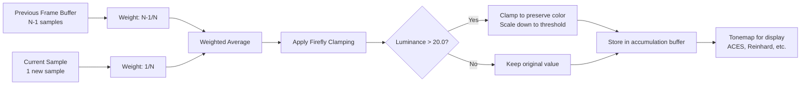

# ChameleonRT Rendering Pipeline

This document provides detailed visual diagrams of ChameleonRT's path tracing pipeline, including the overall rendering loop, path tracing with Multiple Importance Sampling (MIS), and progressive sample accumulation.

## Table of Contents
- [High-Level Overview](#high-level-overview)
- [Detailed Path Tracing Loop](#detailed-path-tracing-loop)
- [Sample Accumulation Strategy](#sample-accumulation-strategy)
- [Rendering Quality Timeline](#rendering-quality-timeline)

---

## High-Level Overview

This diagram shows the top-level rendering loop executed each frame:



**Key Points:**
- Multiple samples per pixel (SPP) for anti-aliasing
- Each sample gets a jittered camera ray for MSAA
- Results are progressively accumulated across frames
- Firefly clamping prevents extreme outliers on glossy surfaces

---

## Detailed Path Tracing Loop

This is the core path tracing algorithm with Multiple Importance Sampling (MIS):



**Algorithm Breakdown:**

### 1. Ray Intersection
- Cast ray into scene using hardware ray tracing (DXR/Vulkan RT)
- If miss: sample environment map (with MIS if not primary ray)
- If hit: proceed to lighting calculations

### 2. Direct Lighting (Multiple Importance Sampling)

**Strategy 1: Light Sampling**
- For each quad light in scene:
  - Randomly sample a point on the light surface
  - Evaluate BRDF at the surface for light direction
  - Trace shadow ray to check visibility
  - If visible: compute MIS weight and add contribution

**Strategy 2: Environment Map Sampling**
- If environment map is loaded:
  - Use importance sampling (CDF-based) to pick direction
  - Evaluate BRDF for that direction
  - Compute MIS weight
  - Add weighted contribution

### 3. Indirect Lighting (BRDF Sampling)

**BRDF-based bounce:**
- Sample Disney BRDF to generate new ray direction
- Check if sampled direction hits any emissive surfaces
- If hit light: compute MIS weight and add contribution
- Use Russian roulette to probabilistically terminate path

### 4. Path Continuation
- Update path throughput by BRDF value and cosine term
- Russian roulette termination (probability based on throughput)
- Continue up to maximum bounce limit (typically 4-8 bounces)

**MIS (Multiple Importance Sampling) Benefits:**
- Combines light sampling and BRDF sampling strategies
- Uses power heuristic to weight contributions
- Reduces variance (less noise) compared to single-strategy sampling
- Especially effective for glossy surfaces and bright light sources

---

## Sample Accumulation Strategy

Progressive rendering with firefly filtering:



**Accumulation Formula:**
```
accumulated[N] = (accumulated[N-1] * (N-1) + new_sample) / N
```

**Firefly Clamping:**
- Computed **after** blending to avoid biasing early frames
- Luminance threshold: **20.0** (configurable constant `FIREFLY_CLAMP_THRESHOLD`)
- Preserves color/hue by scaling down RGB proportionally
- Only affects extreme outliers (bright specular highlights on glossy surfaces)
- Without clamping: single bright pixels ("fireflies") can persist indefinitely

**Why Firefly Clamping is Needed:**
- Glossy surfaces can produce extremely bright reflections (e.g., sun reflection)
- A single 1000+ luminance sample can take hundreds of frames to average out
- Clamping reduces visual noise while preserving overall lighting
- Trade-off: slightly reduces peak brightness but dramatically improves convergence

---

## Rendering Quality Timeline

The path tracer uses **progressive accumulation**. Quality improves over time:

| Frame Range | Quality Level | Characteristics |
|-------------|---------------|-----------------|
| **1-10** | Initial convergence | High noise, basic forms visible, rapid improvement |
| **10-50** | Continued refinement | Noise decreasing, indirect lighting emerging, colors stabilizing |
| **50-200** | High quality | Smooth result, accurate global illumination, subtle details visible |
| **200+** | Near-converged | Diminishing returns, minor refinements, production quality |

### Convergence Examples

**Indoor Scene (Emissive Lights):**
- Frame 1: Noisy, only direct lighting visible
- Frame 10: Indirect light bounces starting to appear
- Frame 50: Room feels illuminated naturally
- Frame 100+: Subtle color bleeding and soft shadows refined

**Outdoor Scene (HDR Sun):**
- Frame 1: Very bright sun, harsh shadows, lots of fireflies
- Frame 10: Fireflies clamped, shadows smoothing
- Frame 50: Sky contribution visible, realistic sky dome lighting
- Frame 100+: Subtle atmospheric effects, accurate exposure

### Recommended Frame Counts

| Use Case | Recommended Frames | Notes |
|----------|-------------------|-------|
| **Preview/Interactive** | 10-20 | Good enough to judge composition and lighting |
| **Final Check** | 50-100 | High quality for validation and testing |
| **Production/Publication** | 200-500 | Near-converged, publication quality |
| **Reference Ground Truth** | 1000+ | Overkill for most cases, but provides baseline |

**💡 Tip:** Let the render accumulate **50-100 frames** for best quality, especially with:
- Outdoor HDR environments containing bright sun
- Glossy materials (metal, mirrors, water)
- Complex indirect lighting scenarios (room with colored walls)
- Scenes with many bounces needed (interior with small windows)

---

## Implementation Notes

### Files
- **Main shader:** `shaders/unified_render.slang`
- **BRDF module:** `shaders/modules/disney_bsdf.slang`
- **Environment sampling:** `util/environment_sampling.cpp` (CDF generation)
- **MIS helpers:** `shaders/modules/lights.slang`

### Key Constants
```slang
static const float EPSILON = 1e-4f;                    // Ray offset to avoid self-intersection
static const float FIREFLY_CLAMP_THRESHOLD = 20.0f;    // Luminance clamp for firefly filtering
static const int MAX_PATH_LENGTH = 8;                   // Maximum ray bounces
```

### Russian Roulette Probability
```slang
// After bounce 3, use path throughput luminance as continuation probability
float continue_prob = min(0.95f, luminance(path_throughput));
if (lcg_randomf(rng) > continue_prob) {
    break; // Terminate path
}
path_throughput /= continue_prob; // Unbiased estimator
```

### MIS Weight Function (Power Heuristic)
```slang
float power_heuristic(float nf, float fPdf, float ng, float gPdf) {
    float f = nf * fPdf;
    float g = ng * gPdf;
    return (f * f) / (f * f + g * g);
}
```

---

## References

- **Multiple Importance Sampling:** Veach & Guibas, "Optimally Combining Sampling Techniques for Monte Carlo Rendering" (1995)
- **Disney BRDF:** Burley, "Physically-Based Shading at Disney" (SIGGRAPH 2012)
- **IBL Importance Sampling:** Pharr, Jakob, Humphreys, "Physically Based Rendering" 3rd Edition, Chapter 13
- **Firefly Clamping:** Practical technique from production renderers (Cycles, Arnold, etc.)

---

## Viewing These Diagrams

These Mermaid diagrams render automatically on GitHub. To view them locally:

1. **VS Code:** Install "Markdown Preview Mermaid Support" extension
2. **Online:** Copy diagrams to [Mermaid Live Editor](https://mermaid.live/)
3. **Command Line:** Use `mermaid-cli` to export as SVG/PNG

```bash
# Install mermaid-cli
npm install -g @mermaid-js/mermaid-cli

# Render diagrams
mmdc -i Rendering_Pipeline.md -o pipeline.png
```
